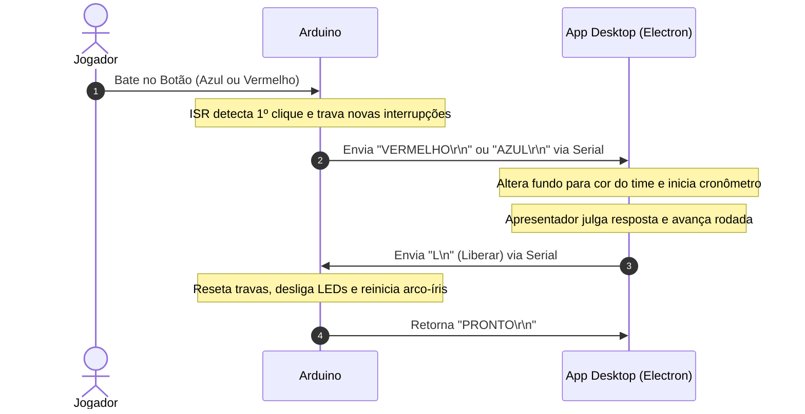

# Quiz Game - Jogo de Perguntas e Respostas Integrado (Arduino + Electron)

Projeto integrado desenvolvido na disciplina de **Tópicos Especiais em Inovação (TEI 4301)** no IFPI.

O sistema consiste em uma plataforma de Quiz interativo para dois competidores ou equipes (Azul e Vermelho), unindo um circuito físico de acionamento rápido microcontrolado por **Arduino** a um aplicativo desktop moderno desenvolvido em **Electron.js** e **Node.js**.

---

## 💡 Visão Geral do Sistema

1. **Aguardando Disputa:** O LED RGB no circuito pulsa em modo arco-íris e o aplicativo aguarda o início da rodada.
2. **Pergunta em Tela:** O apresentador exibe a pergunta através da tela do jogo e libera o momento de resposta.
3. **Bloqueio por Interrupção de Hardware:** Os competidores disputam quem bate no botão primeiro. O Arduino utiliza **Interrupções Externas de Hardware (`INT0` e `INT1`)** para capturar com máxima precisão o primeiro acionamento, bloqueando instantaneamente o competidor adversário e acionando uma sirene de alerta.
4. **Interface e Cronometragem:** O aplicativo desktop recebe a indicação serial do time mais rápido (`AZUL` ou `VERMELHO`), altera a identidade visual da tela para a cor correspondente e inicia um cronômetro regressivo.
5. **Julgamento e Pontuação:** O apresentador julga a resposta como "Certo" (pontuando para o time) ou "Errado" (passando a oportunidade para o adversário responder). Ao avançar para a próxima questão, o app envia um sinal serial liberando o circuito físico.

---

## 📂 Estrutura do Projeto

```text
QuizGame/
├── README.md               # Este documento com a visão geral do projeto
├── spec.md                 # Especificação técnica completa de hardware e software
├── Atividade.md            # Roteiro pedagógico e atividades práticas de sala de aula
├── Codigo.gs               # Script Google Apps Script para importar perguntas do Google Sheets
├── Arduino/                # Firmware do circuito de botões (PlatformIO / C++)
│   ├── platformio.ini      # Configuração do ambiente PlatformIO
│   ├── diagram.json        # Esquema virtual para simulação no Wokwi
│   ├── wokwi.toml          # Arquivo de configuração de simulação
│   ├── README.md           # Documentação técnica do circuito e interrupções
│   └── src/
│       └── main.cpp        # Código-fonte em C++ com rotinas ISR e controle serial
└── AppDesktop/             # Aplicativo Desktop (Electron.js + Node.js)
    ├── package.json        # Manifesto do projeto e dependências npm
    ├── index.js            # Lógica do processo principal e leitura da SerialPort
    ├── inicio.html         # Tela inicial
    ├── style.css           # Estilos e temas de cores dos times
    ├── perguntas.json      # Arquivo JSON com o banco de perguntas da partida
    ├── modelo_perguntas.json # Arquivo de template para estruturação das perguntas
    ├── README.md           # Documentação de interface e regras de negócio
    └── Gabarito/           # Mockups e gabaritos visuais em HTML/CSS
```

---

## 🔌 Protocolo de Comunicação Serial (Arduino ↔ Electron)

A comunicação entre a placa Arduino e o aplicativo Desktop é realizada através de uma porta serial USB (UART) a **9600 bps**:



---

## 🚀 Como Executar

### 1. Gravando o Firmware no Arduino
Consulte a documentação detalhada de pinagem, interrupções e simulação no Wokwi em:
👉 **[QuizGame/Arduino/README.md](file:///home/rpb/IFPI_26.2/TEI%20-%204301/TEI_4301_26/QuizGame/Arduino/README.md)**

Para compilar e gravar via PlatformIO:
```bash
cd QuizGame/Arduino
pio run --target upload
```

### 2. Rodando o Aplicativo Desktop
Consulte as regras de negócio, formato do arquivo de perguntas (`perguntas.json`) e configuração serial em:
👉 **[QuizGame/AppDesktop/README.md](file:///home/rpb/IFPI_26.2/TEI%20-%204301/TEI_4301_26/QuizGame/AppDesktop/README.md)**

Para instalar dependências e inicializar o aplicativo:
```bash
cd QuizGame/AppDesktop
npm install
npm start
```

---

## 📚 Documentos Complementares

* 📄 **[spec.md](file:///home/rpb/IFPI_26.2/TEI%20-%204301/TEI_4301_26/QuizGame/spec.md):** Especificação técnica completa de arquitetura, estados do sistema e protocolos.
* 📄 **[Atividade.md](file:///home/rpb/IFPI_26.2/TEI%20-%204301/TEI_4301_26/QuizGame/Atividade.md):** Roteiro pedagógico da atividade, requisitos de implementação e critérios avaliativos.
* 📄 **[Codigo.gs](file:///home/rpb/IFPI_26.2/TEI%20-%204301/TEI_4301_26/QuizGame/Codigo.gs):** Script para automação e exportação de formulários/planilhas do Google no formato `perguntas.json`.
