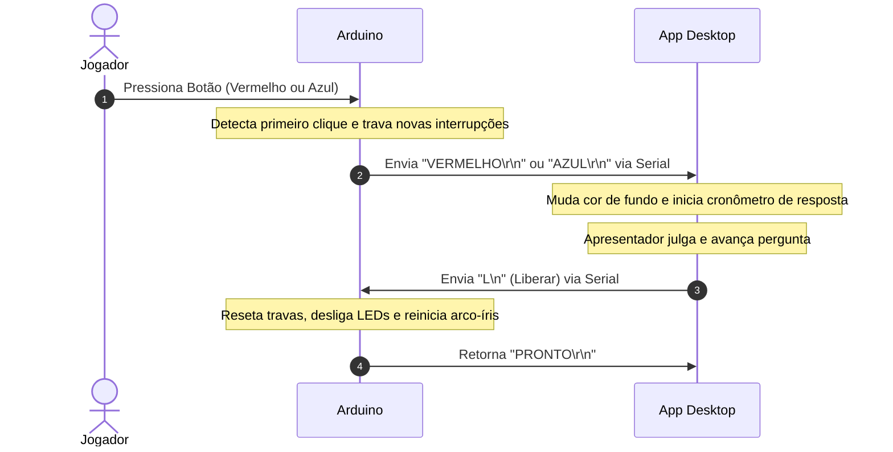

# Jogo de Perguntas e Respostas com Arduino e Electron (Quiz Game)

Este repositório contém o código-fonte de um sistema integrado de Quiz Game para dois jogadores ou times (Azul e Vermelho), desenvolvido como um projeto em sala de aula. O projeto conecta um circuito físico baseado em Arduino a um aplicativo desktop moderno construído com Electron.

---

### 🎓 Informações do Projeto
* **Disciplina:** Tópicos especiais em Inovação
* **Turma:** 4301
* **Ano:** 2026

---

## 💡 Visão Geral do Sistema

O sistema é um jogo de disputa de velocidade física e conhecimentos gerais:
1. **Aguardando Disputa:** O LED RGB no circuito pulsa com um efeito arco-íris suave.
2. **Pergunta na Tela:** Quando uma pergunta é liberada pelo apresentador, os jogadores podem bater em seus respectivos botões.
3. **Bloqueio Super Rápido:** O circuito usa **Interrupções de Hardware** no Arduino para detectar com precisão nanométrica quem apertou primeiro, travando o outro botão na hora e tocando uma sirene.
4. **Interface Interativa:** O aplicativo Desktop muda a cor de fundo para a do jogador vencedor (Azul ou Vermelho), inicia um cronômetro e permite ao apresentador julgar a resposta ("Certo" ou "Errado"), pontuando no placar.

---

## 📂 Estrutura do Repositório

O projeto é organizado da seguinte forma:

```text
TEI_4301_26/
├── spec.md                  # Especificação técnica completa do sistema
├── README.md                # Esta documentação geral do projeto
└── PeR_Game/                # Diretório principal do jogo
    ├── Arduino/             # Projeto firmware do Arduino (PlatformIO)
    │   ├── src/main.cpp     # Código-fonte principal em C++
    │   ├── diagram.json     # Esquema elétrico virtual (Wokwi)
    │   └── README.md        # Documentação específica do circuito e código Arduino
    └── AppDesktop/          # Protótipo do Aplicativo Desktop (Electron)
        ├── Gabarito/        # Telas e layouts em HTML/CSS para teste
        └── README.md        # Documentação de regras de negócio e comunicação serial do app
```

---

## 🔌 Comunicação Serial (Arduino ↔ Electron)

A integração entre o hardware (Arduino) e o software (Electron) é feita via **Porta Serial (USB/UART)** com velocidade de **9600 bps**.



---

## 🛠️ Como Executar o Projeto

### 1. Gravando o Código no Arduino
Consulte as instruções detalhadas em [PeR_Game/Arduino/README.md](file:///home/rpb/Repositórios/TEI_4301_26/PeR_Game/Arduino/README.md).

### 2. Rodando o Aplicativo Desktop
Consulte as instruções detalhadas em [PeR_Game/AppDesktop/README.md](file:///home/rpb/Repositórios/TEI_4301_26/PeR_Game/AppDesktop/README.md).
