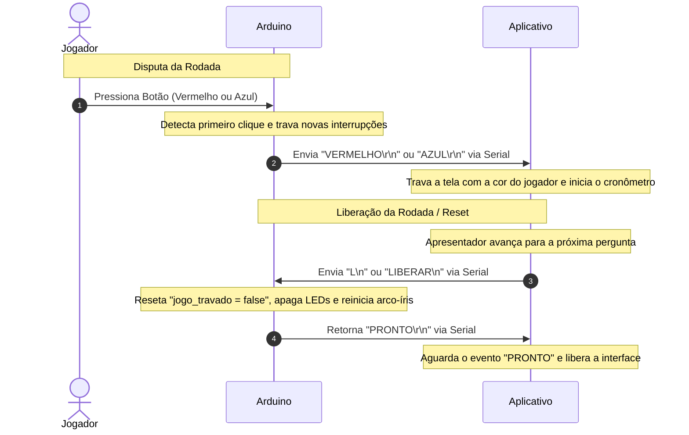

# Especificação Técnica: 

Este documento especifica o funcionamento do hardware (Arduino) e do software (Aplicativo Desktop Electron), bem como o protocolo de comunicação serial entre ambos.


## 1. Funcionamento Geral do Sistema

O sistema é um jogo de Quiz rápido para dois jogadores ou times (Azul e Vermelho). A sequência de funcionamento é a seguinte:

  1. O jogo começa em estado de **Aguardando**. O LED RGB exibe um efeito arco-íris suave.
  2. Quando a pergunta é exibida a pessoa que conduz o jogo libera o momento do aperto dos botões, o led rgb fica verde e assim os jogadores podem tentar apertar o botão o mais rápido que seu adversário. O tempo para resposta deve ser definido pelo apresentador antes do inicio do jogo atravez do menu `Jogo`.
  3. O primeiro a pressionar o botão aciona o alarme (sirene) e seu respectivo led (vermelho ou azul) acende. O jogo "trava" imediatamente não aceitando mais apertos de botões.
  4. A tela do aplicativo muda seu badkground para a cor do jogador que apertou o botão e um cronômetro começa a ser exibido para que os jogadores respondam a pergunta.
  5. O apresentador deve informar se a resposta foi correta ou incorreta clicando no botão `Certo` ou `Errado` no aplicativo desktop:

     - **Se a resposta estiver correta:**
       - Os pontos são contabilizados para o jogador que pressionou o botão (o time correspondente à cor do background atual).
     - **Se a resposta estiver errada:**
     - O background muda para a cor do adversário e o contador de tempo começa a ser exibido novamente.
     - **Se o adversário acertar a resposta:** Os pontos vão para o time da cor do background (o adversário).
     - **Se o adversário errar a resposta:** Ninguém pontua. A única opção para o apresentador é exibir a resposta correta e seguir para a próxima pergunta.

  6. Um placar deve ser exibido durante todo o jogo com a pontuação atual de cada jogador em um formato discreto como uma barra de status na parte inferior da tela.

  7. O ciclo se reinicia e segue assim até a última pergunta.
  8. Ao final, o aplicativo deve exibir o placar final dos jogadores em tela cheia com o background na cor de quem mais pontuou. Se possivel com animação e efeitos como confetes de forma contínua.
  9. Ao final do jogo, o apresentador deve clicar em "Novo Jogo" para reiniciar o jogo.

---

## 2. Especificação do Hardware (Arduino)

O código roda em um Arduino Uno ou Nano. Para garantir máxima precisão e imparcialidade, a leitura dos botões é feita através de **Interrupções de Hardware**.

### 2.1. Pinagem Utilizada
| Componente | Pino Arduino | Tipo de Sinal | Notas / Configuração |
| :--- | :---: | :---: | :--- |
| **Botão Vermelho** | 2 | Entrada | `INPUT_PULLUP` (Usa Interrupção `INT0`) |
| **Botão Azul** | 3 | Entrada | `INPUT_PULLUP` (Usa Interrupção `INT1`) |
| **LED Azul** | 4 | Saída | Ativa com sinal `HIGH` |
| **LED Vermelho** | 13 | Saída | Ativa com sinal `HIGH` |
| **RGB Vermelho** | 11 | Saída (PWM) | Controle de intensidade da cor Vermelha |
| **RGB Verde** | 9 | Saída (PWM) | Controle de intensidade da cor Verde |
| **RGB Azul** | 10 | Saída (PWM) | Controle de intensidade da cor Azul |
| **Buzzer (Sirene)** | 8 | Saída | Emite sons em frequências variáveis |

### 2.2. Máquina de Estados do Arduino
* **Estado 1: Aguardando (`jogo_travado == false`)**
  * O LED RGB executa a função `transicaoSuave()`, gerando um efeito arco-íris fluido.
  * Os botões estão habilitados.
* **Estado 2: Vitória da Rodada (`jogo_travado == true`)**
  * A interrupção detecta o primeiro botão a ir para `LOW` e trava novos registros.
  * O Arduino envia via Serial a string correspondente (`"AZUL"` ou `"VERMELHO"`).
  * O LED do jogador vencedor acende de forma fixa.
  * O LED RGB assume a cor do vencedor de forma estática (Vermelho puro ou Azul puro).
  * A sirene toca por 2 segundos.
  * O Arduino entra em espera passiva, aguardando o comando de liberação do aplicativo desktop.

---

## 3. Protocolo de Comunicação Serial

A comunicação ocorre via cabo USB (Emulação de Porta Serial / UART).

* **Configuração da Porta:**
  * **Baud Rate:** 9600 bps
  * **Data Bits:** 8
  * **Parity:** None
  * **Stop Bits:** 1

### 3.1. Mensagens Enviadas pelo Arduino (Saídas)
Disparadas no momento exato em que um botão de interrupção é acionado.

| Mensagem | Origem | Descrição |
| :--- | :--- | :--- |
| `AZUL\r\n` | Arduino | O jogador Azul pressionou o botão primeiro. |
| `VERMELHO\r\n` | Arduino | O jogador Vermelho pressionou o botão primeiro. |

### 3.2. Mensagens Recebidas pelo Arduino (Entradas)
Comandos enviados pelo Aplicativo Desktop para controlar o hardware.

| Comando | Ação no Arduino | Resposta do Arduino |
| :--- | :--- | :--- |
| `L\n` ou `LIBERAR\n` | Reseta `jogo_travado = false`, apaga LEDs indicadores e reinicia a transição de cores suave. | `PRONTO\r\n` |

---

---

## 4. Especificação do Aplicativo (Desktop Electron)

Embora o aplicativo web/desktop ainda esteja em fase de protótipo, ele deve seguir os seguintes requisitos técnicos de integração com o Arduino:

### 4.1. Integração Serial (Node.js)
O aplicativo deve utilizar a biblioteca `serialport` do Node.js para gerenciar a conexão com a porta serial correspondente do Arduino (ex: `/dev/ttyUSB0` no Linux ou `COM3` no Windows).

1. **Auto-conexão:** O app deve listar as portas seriais disponíveis e tentar se conectar ao Arduino automaticamente (ou permitir a escolha manual nas configurações do host).
2. **Buffer de Entrada:** Deve escutar os dados vindos da porta serial e tratá-los utilizando um parser de linha (como `ReadLineParser` com delimitador `\r\n`).

### 4.2. Fluxo de Tela e Regras de Negócio
1. **Tela de Apresentação da Pergunta:**
   * O apresentador clica em "Iniciar Pergunta".
   * A pergunta aparece na tela para os jogadores.
2. **Monitoramento de Resposta:**
   * O app fica aguardando o evento serial do Arduino.
   * Assim que chega `"AZUL"` ou `"VERMELHO"`:
     * O cronômetro da pergunta pausa.
     * O app bloqueia visualmente a tela indicando qual jogador bateu primeiro.
     * Inicia-se o tempo de resposta do jogador (ex: 15 segundos para responder verbalmente).
3. **Validação da Resposta (Apresentador):**
   * O apresentador clica no botão do aplicativo "Certo" ou "Errado".
   * O app computa os pontos no placar geral.
   * O app exibe os botões de controle "Próxima Pergunta".
4. **Liberação da Rodada:**
   * Ao avançar para a próxima pergunta (ou ao reiniciar a pergunta atual em caso de erro), o aplicativo envia obrigatoriamente a string `"L\n"` via porta serial para o Arduino.
   * O aplicativo deve aguardar receber `"PRONTO"` do Arduino para confirmar que o hardware está pronto para a nova disputa.

### 4.3. Formato do Arquivo de Perguntas (JSON)
As perguntas e respostas são carregadas a partir de um arquivo chamado `perguntas.json`, que deve estar localizado no mesmo diretório do executável/programa principal.

O arquivo deve seguir a estrutura de um array de objetos JSON:

```json
[
  {
    "pergunta": "Qual é a capital do Brasil?",
    "respostas": [
      "São Paulo",
      "Rio de Janeiro",
      "Brasília",
      "Salvador"
    ],
    "respostaCorreta": 2
  }
]
```

**Requisitos do arquivo:**
- A chave `respostaCorreta` deve conter o índice (0-based) da resposta correta no array `respostas`.
- A numeração das respostas deve seguir a ordem crescente começando do índice `0`.
